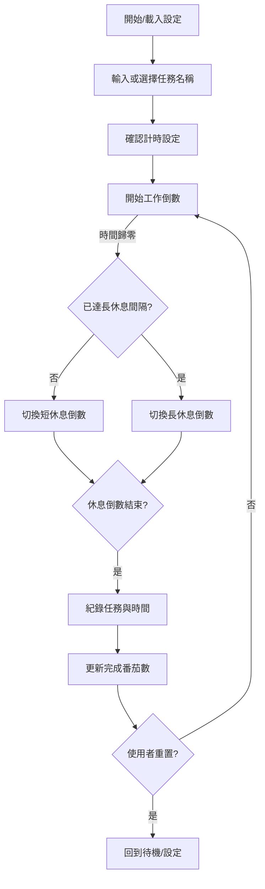
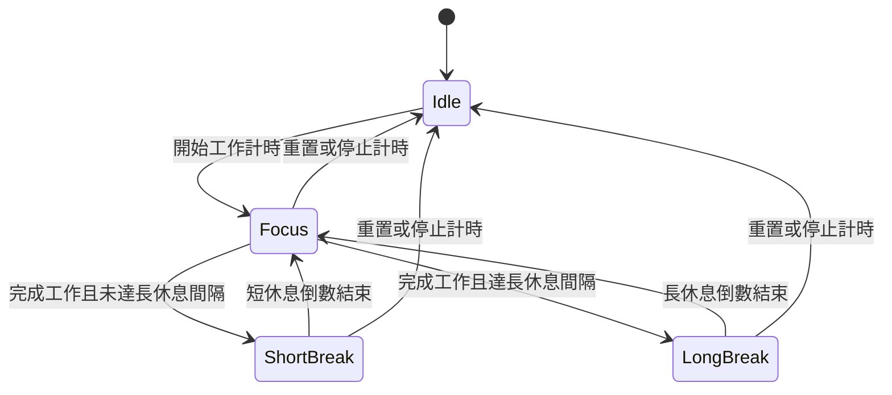

# 蕃茄鐘網頁應用產品需求文件

## 1. 產品概述
- **產品名稱**：Pomodoro Web App
- **產品定位**：簡潔易用的網頁版蕃茄鐘工具，協助使用者透過番茄工作法專注完成任務並追蹤成效。
- **產品目標**：提供直覺的計時體驗、可視化的產出報表，以及靈活的時間設定，滿足個人及小型團隊的生產力需求。

## 2. 目標使用者
- 需管理個人工作節奏的知識工作者與學生。
- 需要紀錄工作內容並檢視成效的自由工作者。
- 欲追蹤團隊專注時間的主管或協作者。

## 3. 功能需求
### 3.1 蕃茄鐘計時
- `FR-1` 基本倒數 25 分鐘工作、5 分鐘休息的番茄工作流程，計時開始時顯示當前階段標籤與剩餘輪次資訊。
- `FR-2` 提供工作階段與休息階段的自動切換，並於切換瞬間觸發視覺與音效提示以強調狀態轉換。
- `FR-3` 倒數計時器需顯示剩餘時間（分鐘與秒），並在最後 10 秒提供顯著視覺提醒（如文字顏色或動畫）。
- `FR-4` 支援暫停、繼續、重置計時；暫停後可於同一位置顯示「繼續」按鈕，重置需回復至初始設定並清空當前任務輸入。

### 3.2 自訂計時設定
- `FR-5` 使用者可自訂工作時間、短休息、長休息的長度，輸入時需即時驗證上下限並顯示單位提示。
- `FR-6` 支援設定每輪多少個番茄後進入長休息，並於計時畫面顯示距離長休息尚需完成的番茄數。
- `FR-7` 提供多組自訂設定的儲存與切換（選用需求，可於後續版本實作），切換預設後需即時更新預覽與下一輪計時參數。

### 3.3 任務管理
- `FR-8` 開始計時前可輸入番茄鐘「名稱」以記錄工作內容，計時開始後需鎖定輸入避免誤觸修改。
- `FR-9` 提供預設任務類型選單，使用者可直接選擇常見工作類型並可快速輸入自訂名稱，列表需支援鍵盤操作與搜尋。
- `FR-10` 命名欄位支援快取常用或歷史任務名稱以便快速重複使用，並以標籤或按鈕形式呈現供一鍵套用。
- `FR-11` 每次完成番茄鐘後自動記錄任務名稱、時間與日期，包括階段類型（工作/短休息/長休息）與所用設定。

### 3.4 報表與分析
- `FR-12` 提供日報表視圖：顯示當日完成的番茄鐘數量、對應任務及完成時間軸，並以圖表呈現時段分布。
- `FR-13` 週報表視圖：統計一週內各任務的番茄鐘總數與趨勢，需顯示每日累積圖與任務排行。
- `FR-14` 月報表視圖：呈現每月番茄鐘完成數、任務類別占比與每週趨勢，支援跨月切換。
- `FR-15` 報表需支援按任務名稱搜尋或篩選，並顯示篩選結果總計以便對照。
- `FR-16` 報表可匯出為 CSV（選用需求），匯出檔案需包含任務名稱、階段類型、開始/結束時間與設定參數。

### 3.5 分頁功能詳述
- `計時器分頁`：
  - 主要呈現倒數計時器、任務輸入與控制按鈕。啟動前需驗證任務名稱；計時進行時顯示當前階段、剩餘時間、已完成番茄數以及距離長休息的剩餘番茄數。
  - 若使用者在進行中欲切換分頁，計時仍持續；回到此分頁時需同步顯示最新剩餘時間與階段狀態。
  - 提供歷史任務快捷鍵與預設任務下拉選單，點擊即覆寫任務欄位並準備開始。
- `報表分頁`：
  - 上方提供 `日 / 週 / 月` 切換，切換後對應的圖表與統計需動畫更新並保留搜尋條件。
  - 搜尋輸入框支援即時篩選任務名稱，顯示符合條件的番茄數與工作時數；若無資料需顯示空狀態引導回到計時器分頁開始新任務。
  - 圖表支援滑鼠懸停顯示細節、行動裝置手勢捲動，並提供簡短說明文字解釋指標含義。
- `設定分頁`：
  - 以表單呈現工作時間、短休息、長休息、長休息間隔等欄位，輸入時提供即時驗證與錯誤訊息。
  - 下方顯示當前設定預覽卡片，並提供快速設定按鈕；套用後需提示「尚未儲存變更」。
  - 儲存按鈕需在有變更時才啟用，按下後同步更新計時器參數；重置按鈕則回復至預設值並標註已重置時間戳（選用）。

## 4. UI/UX 要求
- `UI-1` 首頁展示清楚的倒數計時器，包含當前階段標籤、剩餘時間與控制按鈕，並於行動裝置維持大尺寸字體易讀性。
- `UI-2` 控制按鈕包含開始、暫停、繼續、重置，並依狀態顯示可用/不可用狀態，同時提供按鈕文字與圖示提示行為。
- `UI-3` 計時畫面需顯示番茄鐘名稱輸入區及目前輪次進度條，進度條需同步反映距離長休息的剩餘番茄數。
- `UI-4` 報表頁需提供切換日/週/月的分頁或選單，以及清晰的圖表（長條圖、折線圖或圓餅圖），圖表需支援滑鼠懸停顯示細節與行動裝置手勢捲動。
- `UI-5` 顏色與排版需簡潔，確保在桌面與行動版瀏覽器上皆有良好可讀性，並提供深色模式支援（選用）。

## 5. 系統流程
1. 使用者輸入或選擇任務名稱，並確認所需的計時設定（預設或自訂）。
2. 點擊「開始」後進入工作倒數，UI 同步顯示階段標籤、剩餘時間與控制按鈕。
3. 工作計時歸零時發出提醒並自動切換到休息階段：
   - 若當前完成的工作次數未達到設定的長休息間隔，進入短休息倒數。
   - 達到設定間隔時則改為長休息倒數，並在畫面上標示長休息狀態。
4. 休息倒數結束後發出提醒，自動回到下一輪工作計時並重置倒數。UI 顯示已完成番茄數與距離長休息的剩餘番茄數。
5. 每完成一次工作階段，系統記錄任務名稱、時間與階段資訊，累積成報表資料。
6. 使用者可在任何時刻切換至報表頁檢視日/週/月統計，或返回設定頁調整計時參數後再開始新一輪番茄鐘。

### 5.1 系統流程圖

### 5.2 狀態圖
- `待機`：尚未開始計時或使用者已重置，等待輸入任務與設定。
- `專注`：執行工作倒數時的狀態，需顯示任務名稱與剩餘時間。
- `短休息`：進入短休息倒數，用於快速恢復。
- `長休息`：達到設定的番茄數後進入的深度休息。

### 5.3 控制按鈕行為
- `開始` / `繼續`：
  - `待機` 狀態下，只有在任務名稱欄位非空且時間設定有效時才允許按下「開始」；啟動後立即切換為 `專注` 狀態並鎖定任務欄位。
  - `專注`、`短休息`、`長休息` 狀態被暫停時，按鈕文字改為「繼續」，點擊後自暫停時的剩餘時間重新倒數。
- `暫停`：在 `專注`、`短休息`、`長休息` 狀態進行中可觸發，立即停止倒數並保留剩餘時間；觸發後按鈕狀態切換為「繼續」，並記錄暫停時間點（選用）。
- `重置`：任何狀態皆可觸發，會停止倒數、回復至初始工作階段、重新載入目前設定值，同時清空本輪任務名稱與已選模板，畫面回到 `待機` 狀態；已完成的歷史紀錄不受影響。
- `任務輸入`：僅在 `待機` 狀態可編輯，聚焦時顯示「輸入你要專注的任務…」提示並立即驗證（不得為空或僅空白）；在暫停或進行中的其他狀態維持唯讀，除非使用者先重置流程。

#### 狀態 × 控制可用性矩陣
| 狀態       | 任務輸入 | 開始/繼續 | 暫停 | 重置 |
|------------|----------|-----------|------|------|
| 待機       | 可編輯   | 啟用 (條件：任務名稱有效) | -    | 啟用 |
| 專注 (進行)| 鎖定     | 隱藏 / 改為暫停 | 啟用 | 啟用 |
| 專注 (暫停)| 鎖定     | 啟用 (顯示為繼續) | 隱藏 | 啟用 |
| 短休息 (進行)| 鎖定   | 隱藏 / 改為暫停 | 啟用 | 啟用 |
| 短休息 (暫停)| 鎖定   | 啟用 (顯示為繼續) | 隱藏 | 啟用 |
| 長休息 (進行)| 鎖定   | 隱藏 / 改為暫停 | 啟用 | 啟用 |
| 長休息 (暫停)| 鎖定   | 啟用 (顯示為繼續) | 隱藏 | 啟用 |

## 6. 技術與整合需求
- 前端建議使用 React 或 Vue 等主流框架，支援進階狀態管理與圖表組件。
- 資料儲存可先採用瀏覽器 LocalStorage 實作 MVP，後續可連接後端資料庫（如 Firebase、Supabase）。
- 報表圖表可採用 Chart.js、ECharts 等開源套件。
- 提醒功能需支援瀏覽器通知與音效提示。

## 7. 成功衡量指標
- 首月每日活躍使用者（DAU）達 100 人。
- 使用者平均每日完成番茄鐘數 ≥ 4。
- 使用者對 UI 易用性的滿意度（問卷）達 80% 以上。

## 8. 進階與未來規劃（選用）
- 與行事曆整合，將番茄鐘記錄同步到 Google Calendar。
- 提供團隊共享報表與排行榜。
- 開放 API 或匯出數據格式供其他生產力工具使用。
